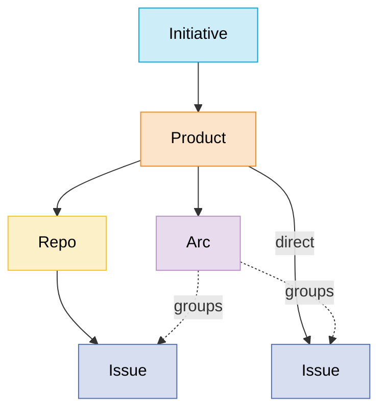

# Progress — Reference

The system **as built** (milestones 1–5, 2026-06-11/12). Information-oriented
and present tense throughout; if it's described here, it works today. For
vision and unbuilt work see [`SPEC.md`](./SPEC.md); for rationale see
[`DECISIONS.md`](./DECISIONS.md) (D-numbers below refer to its entries).

## 1. Stack & layout

| Layer | Choice |
|---|---|
| Hosting | Cloudflare Workers (single Worker: API + static assets; local-only today, deploy is a remaining milestone) |
| API | Hono (TypeScript, ESM) |
| Database | Cloudflare D1 (SQLite) via Drizzle ORM; local D1 under `.wrangler/state/` |
| Frontend | React 19 + Vite + Tailwind 4 |
| Client state | TanStack Query, whole workspace in one cache entry (D21) |
| Routing | wouter (D22) |
| Drag & drop | @dnd-kit/core (D23) |
| Markdown | react-markdown + hand-rolled `.prose-lite` styles |
| Tooling | Bun (packages & scripts), Node 22 LTS, TypeScript strict, ESM |

| Path | Purpose |
|---|---|
| `src/worker/index.ts` | The whole Hono API |
| `src/client/` | React app (`main.tsx` entry, `pages/`, `commands/` = palette/dialogs/keys) |
| `src/client/store.ts` | Client store: workspace cache + every optimistic mutation |
| `src/shared/` | Wire types (`types.ts`) and fixed vocabularies (`constants.ts`) shared client/server |
| `src/db/schema.ts` | Drizzle schema — single schema source of truth, generates `drizzle/` migrations |
| `scripts/` | `seed.sql` (idempotent baseline), `seed-scale.ts` (5k-issue synthetic workspace) |

## 2. Domain model

| Entity | Parent | Notes |
|---|---|---|
| Initiative | — | Portfolio-level theme grouping products. |
| Product | Initiative | The central unit; carries the issue-key prefix (`keyPrefix`, 2–8 letters, globally unique, editable) and the per-product issue-number sequence (`nextIssueNumber`). |
| Repo | Product | Sub-container mirroring a real git repository (`gitUrl`, optional until connected). |
| Arc | Product | Epic-like grouping of issues from anywhere under its product. (The words "epic" and "project" are banned.) |
| Issue | Product *or* Repo | The atomic unit. `productId` always set; nullable `repoId` narrows the container (D17). Optional `arcId`, same-product enforced. |
| Tag | — (global) | Name + auto-color (stable hash into a fixed 7-color palette, D27). |

### Containment & movement rules (as enforced)

- An issue's container is a product or one of that product's repos — never
  both, never neither. Repo-in-product and arc-in-product invariants are
  API-enforced (SQLite can't express them cheaply).
- Issues move freely between containers. **Within a product**: the key and
  arc survive; only `repoId` changes. **Across products**: the issue is
  re-keyed from the target's sequence, its arc is cleared, and the old key
  is written to `issue_key_aliases` as a permanent redirect (D18, D24).
- Issue keys are **derived, never stored**: `product.keyPrefix + "-" +
  issue.number`. Renaming a prefix re-keys everything consistently; alias
  rows store retired keys verbatim so they survive renames too.
- **Archive, no hard deletes** — all four container types carry
  `archivedAt`. Archived containers leave board filters, creation targets,
  move targets, and palette search; their issues stay visible everywhere;
  parent pages list them dimmed so unarchive stays reachable (D26).

### Issue anatomy

| Field | Values |
|---|---|
| Key | `PREFIX-n`, derived (see above) |
| Title, Description | text / Markdown, both inline-editable |
| Status | `backlog` · `todo` · `in_progress` · `in_review` · `done` · `canceled` — fixed global set |
| Priority | `urgent` · `high` · `medium` · `low` · `none` (default `none`) |
| Estimate | 0 / 1 / 2 / 3 / 5 / 8 points, or null |
| Tags | 0..n global tags |
| Arc | 0..1, same product |
| Comments + Activity | Markdown thread interleaved with append-only events into one timeline |
| Timestamps | `createdAt`, `updatedAt`, `completedAt` (set iff status is `done`) |
| Creator / assignee | user references (one `usr_owner` row in v1; schema is multi-user-ready, D13) |

Fixed vocabularies live in `src/shared/constants.ts` and are shared verbatim
by schema, API validation, and client.

### Data conventions (D19)

- IDs: app-generated text with type prefixes — `usr_ ini_ prd_ rep_ arc_
  iss_ tag_ cmt_ act_` — identifiable on sight in URLs and logs.
- Container and tag ids may be **client-generated** (the store creates rows
  optimistically and navigates immediately; the server accepts well-formed
  ids verbatim, D26).
- Timestamps: unix-epoch integers set by the API, never DB defaults.
- Activity rows are append-only; `data` carries the event payload. Current
  event types: `status_changed` `{from, to}`, `moved` `{fromProductId,
  fromRepoId, toProductId, toRepoId, fromKey?, toKey?}` (keys present only
  on cross-product moves), `pr_linked` `{githubRepo, prNumber, title, url,
  state}`, `commit_linked` `{githubRepo, sha, message, url, branch}`.

### Git links (D29)

Two tables, written only by the GitHub webhook: `pr_links` (PK `issueId +
githubRepo + prNumber`; mutable `state` open/merged/closed and `title`) and
`commit_links` (PK `issueId + sha`; immutable, message stored as subject
line only). `githubRepo` is `"owner/name"` text, deliberately **not** an FK
to `repos` — links survive container renames/archives and can arrive from
repos that aren't containers here. Composite PKs double as the idempotency
guard for webhook redeliveries. Links are permanent: editing the mention
away later does not unlink.

## 3. API

All routes are JSON under `/api`. Errors are `{ error: string }` with 400
(validation), 404 (missing), or 409 (key-prefix conflict). The single-user
write identity is `usr_owner`.

### Workspace & issues

| Route | Behavior |
|---|---|
| `GET /api/health` | `{ ok: true }` |
| `GET /api/workspace` | The load-everything payload: users, initiatives, products, repos, arcs, issues, tags, issueTags, issueKeyAliases — one D1 batch. Comments/activity are deliberately excluded (D20). |
| `POST /api/issues` | `{ title, productId, repoId?, arcId?, description?, status?, priority?, estimate? }` → 201 `{ issue }`. Number allocated by atomic increment of the product sequence; gaps from failed creates are harmless (D24). |
| `PATCH /api/issues/:id` | Any of `title, description, status, priority, estimate, arcId` — validated per field; arc must be same-product. A status change atomically appends a `status_changed` activity row and maintains `completedAt`. |
| `POST /api/issues/:id/move` | `{ productId, repoId }` (`repoId: null` = product-level). Within-product keeps key + arc; cross-product re-keys, clears arc, writes the alias, logs `moved`. 400 on no-op. |
| `GET /api/issues/:id/timeline` | `{ comments, activity, pullRequests, commits }`, each ordered by `createdAt`. |
| `POST /api/issues/:id/comments` | `{ body }` → 201 `{ comment }`. |

### Tags

| Route | Behavior |
|---|---|
| `POST /api/issues/:id/tags` | `{ tagId }` assigns an existing tag; `{ name, id? }` creates-or-gets by name (auto-color) then assigns — one atomic call (D27). Link insert is idempotent. → 201 `{ tag, link }`. |
| `DELETE /api/issues/:id/tags/:tagId` | Unlinks. Tag rows are never deleted. |

### Containers (D26)

| Route | Behavior |
|---|---|
| `POST /api/initiatives` | `{ id?, name, description? }` |
| `POST /api/products` | `{ id?, name, initiativeId, keyPrefix, description? }` — prefix validated `^[A-Z]{2,8}$` (uppercased), 409 if taken |
| `POST /api/repos` | `{ id?, name, productId, gitUrl?, description? }` |
| `POST /api/arcs` | `{ id?, name, productId, description? }` |
| `PATCH /api/<type>/:id` | `{ name?, description?, archived? }` for all four; plus `keyPrefix?` (products), `gitUrl?` (repos). `archived: boolean` maps to `archivedAt`. |

All return `{ container }`; creates return 201.

### GitHub webhook (D29)

`POST /api/webhooks/github` — authenticated by GitHub's
`X-Hub-Signature-256` HMAC (SHA-256 over the raw body, constant-time
compare) against the `GITHUB_WEBHOOK_SECRET` binding (local: `.dev.vars`;
production: `wrangler secret put`). 503 when unconfigured, 401 on a bad
signature; unhandled events are acknowledged with `{ ok, ignored }`.

Magic words: candidates matching `\b[A-Za-z]{2,8}-\d+\b` are resolved
against current issue keys first, then retired alias keys; unknown prefixes
simply don't resolve (so prose like "UTF-8" can't false-positive).

- **`push`**: keys in the branch name link every commit in the push; keys
  in a commit message link that commit. New links append `commit_linked`
  activity; redeliveries are no-ops.
- **`pull_request`**: keys in the title, body, or source-branch name link
  the PR. First sight inserts the link + `pr_linked` activity; later events
  (edit/close/merge/reopen) update title and state in place, silently.
  GitHub's closed+merged flag is normalized to the `merged` state.

## 4. Client architecture

### The store (`src/client/store.ts`)

- One TanStack Query cache entry `['workspace']` holds the entire workspace,
  fetched once with `staleTime: Infinity` — this client is the only writer,
  so nothing goes stale on its own (D21). Components subscribe to slices via
  `useWorkspaceSlice`; structural sharing keeps re-renders scoped.
- Per-issue timelines are separate `['issue', id, 'timeline']` queries,
  loaded when an issue page opens and invalidated by mutations that append
  activity.
- **Every mutation is optimistic** (SPEC §8.2 is a hard requirement): write
  the cache synchronously, sync in the background, and on failure restore
  exactly the touched state and raise a toast. No interaction ever waits on
  the server:
  - Field updates snapshot/restore the one issue or container.
  - **Creates allocate identity locally** — issue numbers from the store's
    `nextIssueNumber` mirror, container/tag ids generated client-side — so
    navigation to the new entity is instant and survives reconciliation
    with the server row.
  - **Moves** mirror the full server semantics locally, including the
    cross-product re-key and alias append, so an open issue page redirects
    to its canonical key with no round trip.

### Routing & key resolution

Routes: `/` (board), `/issue/:key`, `/initiative/:id`, `/product/:id`,
`/repo/:id`, `/arc/:id`. Issue URLs are key-based; `findIssueByKey` resolves
current keys first, then alias keys with a `replaceState` redirect to the
canonical key — entirely client-side from the loaded workspace (D22).

## 5. UI surfaces

- **Board (`/`)** — the global "My Work" kanban. Columns are the fixed
  statuses; Backlog hides behind a toggle by default. Filters (initiative,
  product, repo, arc, tag, priority) live in URL query params, so any
  filtered board is bookmarkable — this is how per-container boards are
  covered without existing (D23). Drag-and-drop between columns sets status:
  mouse drags activate after 4px of movement (plain clicks navigate), touch
  drags after a 250ms press-and-hold (plain swipes scroll the board) — D30.
- **Container pages** — description-on-top open page (inline-editable name,
  Markdown description, key prefix / git URL where applicable, archive
  toggle), child-container chips with "+ New" buttons, and a
  sortable/filterable issue list with inline status/priority edits.
- **Issue page** — inline-editable title and description, sidebar fields
  (status/priority/estimate selects; container, arc, and tags with picker
  buttons), a Git section (linked PRs with state badges, commits with short
  shas, linking out to GitHub), and comments + activity interleaved into
  one timeline.
- **Command palette** — one keyboard surface (D25): root mode searches
  issues by key (retired alias keys included) or title and containers by
  name, and lists commands (create issue/initiative/product/repo/arc,
  pickers for the current issue). Picker modes are filterable lists; tag
  toggles keep the palette open for multi-edit.
- **Create dialogs** — issue and container creation; parents/containers
  default from the current view (open container page, viewed issue's
  container, or active board filters). New issues default to **Todo** so
  they're visible on the default board.

### Keyboard map (D25, D27)

| Key | Action |
|---|---|
| `⌘K` / `Ctrl+K` | Command palette |
| `C` | Create issue |
| `S` / `P` / `E` | Status / priority / estimate picker for the current issue |
| `M` / `A` / `T` | Move / arc / tag picker for the current issue |
| `↑↓`, `Enter`, `Esc`, `Backspace` | Navigate / run / close / back-to-root inside the palette |

"Current issue" = the issue page's issue, or the card/row under the pointer
or keyboard focus on boards and lists (tracked via `data-issue-id`
delegation). Plain keys are suppressed while typing in any input.

## 6. Performance baseline

The architecture was validated by a latency spike before adoption (D21):
5,000-issue synthetic workspace, 100 real DOM clicks in headless Chromium —
TanStack Query at 23 ms p50 / 98 ms p95 click-to-paint on the worst-case
all-columns board. Regenerate the dataset with `bun run db:seed:scale`.
