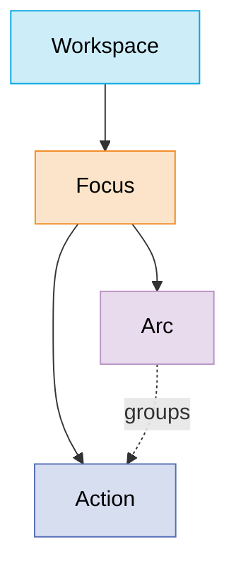

# Progress — Reference

The system **as built** (milestones 1–5, 2026-06-11/12). Information-oriented
and present tense throughout; if it's described here, it works today. For
vision and unbuilt work see [`SPEC.md`](./SPEC.md); for rationale see the
decision log ([`DECISIONS.md`](./DECISIONS.md) for the convention — D-numbers
below resolve in [`decisions/D1-D49.md`](./decisions/D1-D49.md), issue keys in
`decisions/<KEY>.md`).

## 1. Stack & layout

| Layer | Choice |
|---|---|
| Hosting | Cloudflare Workers (single Worker: API + static assets) — production at <https://progress.bck.dev>, D1 `progress-db` (ENAM) |
| API | Hono (TypeScript, ESM) |
| Database | Cloudflare D1 (SQLite) via Drizzle ORM; local D1 under `.wrangler/state/` |
| Frontend | React 19 + Vite + Tailwind 4 |
| Client state | TanStack Query, the whole snapshot in one cache entry (D21) |
| Routing | wouter (D22) |
| Drag & drop | @dnd-kit/core + @dnd-kit/sortable (D23, D44) |
| Markdown | react-markdown + hand-rolled `.prose-lite` styles |
| Tooling | Bun (packages & scripts), Node 22 LTS, TypeScript strict, ESM |

| Path | Purpose |
|---|---|
| `src/worker/index.ts` | The whole Hono API |
| `src/client/` | React app (`main.tsx` entry, `pages/`, `commands/` = palette/dialogs/keys) |
| `src/client/store.ts` | Client store: snapshot cache + every optimistic mutation |
| `src/shared/` | Wire types (`types.ts`) and fixed vocabularies (`constants.ts`) shared client/server |
| `src/db/schema.ts` | Drizzle schema — single schema source of truth, generates `drizzle/` migrations |
| `src/mcp/tools.ts` | Progress MCP toolset — transport-agnostic client of the API (D34) |
| `src/mcp/server.ts` | Local stdio MCP transport (`bun run mcp`) |
| `src/worker/mcp.ts` | Hosted MCP transport — `POST /api/mcp`, Streamable HTTP, stateless |
| `bin/progress.ts` | `progress work <KEY>` kickoff CLI — bundle → branch → `claude` (D35) |
| `scripts/` | `seed.sql` (idempotent baseline), `seed-scale.ts` (5k-action synthetic dataset) |

## 2. Domain model

| Entity | Parent | Notes |
|---|---|---|
| Workspace | — | Portfolio-level theme grouping focuses. |
| Focus | Workspace | The central unit; carries the action-key prefix (`keyPrefix`, 2–8 letters, globally unique, editable), the per-focus action-number sequence (`nextActionNumber`), and an optional `gitUrl` — the git repo this focus mirrors (display-only link + agent context; PROG-102 folded the former Repo container into this field). |
| Arc | Focus | Epic-like grouping of actions from anywhere under its focus. (The words "epic" and "project" are banned.) |
| Action | Focus | The atomic unit. `focusId` is the sole container (D17, PROG-102). Optional `arcId`, same-focus enforced. |
| Step | — (not a table) | An action whose `parentActionId` is set (PROG-124's sub-issue self-reference, renamed by PROG-98) — same row shape, no separate entity. |
| Tag | — (global) | Name + auto-color (stable hash into a fixed 7-color palette, D27). |

Nouns are per PROG-98 (the hierarchy rename); pre-rename docs/decisions say
Initiative/Product/Issue for Workspace/Focus/Action. The plural of Focus is
**focuses**. **Repo** was a first-class container through v2; PROG-102 demoted it
to the focus's optional `gitUrl` field — pre-PROG-102 docs/decisions describe the
old container.

### Containment & movement rules (as enforced)

- An action's container is its **focus** — always exactly one (PROG-102). The
  arc-in-focus invariant is API-enforced (SQLite can't express it cheaply).
- Actions move between **focuses**. A move re-keys the action from the target's
  sequence, clears its arc — or lands it in a caller-named arc **of the target
  focus** (PROG-118) — and writes the old key to `action_key_aliases` as a
  permanent redirect (D18, D24). A move to the action's current focus is a no-op.
- Action keys are **derived, never stored**: `focus.keyPrefix + "-" +
  action.number`. Renaming a prefix re-keys everything consistently; alias
  rows store retired keys verbatim so they survive renames too. Keys and
  their derivation were untouched by the PROG-98 rename.
- **Archive, no hard deletes** — all three container types carry
  `archivedAt`. Archived containers leave board filters, creation targets,
  move targets, and palette search; their actions stay visible everywhere;
  parent pages list them dimmed so unarchive stays reachable (D26).

### Action anatomy

| Field | Values |
|---|---|
| Key | `PREFIX-n`, derived (see above) |
| Title, Description | text / Markdown, both inline-editable |
| Status | `backlog` · `todo` · `in_progress` · `in_review` · `done` · `canceled` — fixed global set. New actions default to `backlog` on every creation surface (`DEFAULT_ACTION_STATUS`, PROG-115) |
| Priority | `urgent` · `high` · `medium` · `low` · `none` (default `none`) |
| Estimate | 0 / 1 / 2 / 3 / 5 / 8 points, or null |
| Due date | Optional calendar day, ISO `YYYY-MM-DD` (timezone-safe, not an instant); drives the Agenda (D37) |
| Board order | `rank` — a fractional-index key (`src/shared/rank.ts`) giving each card a manual vertical position in its column; drag a card above/below another. Always set; one-row reorder, no renumbering (D44) |
| Tags | 0..n global tags |
| Arc | 0..1, same focus |
| Parent action | 0..1 `parentActionId`, same focus, acyclic — makes this action a **step**, nestable to any depth (PROG-124). API-enforced; a cross-focus move clears it and detaches children |
| Comments + Activity | Markdown thread interleaved with append-only events into one timeline |
| Timestamps | `createdAt`, `updatedAt`, `completedAt` (set iff status is `done`) |
| Creator / assignee | user references (one `usr_owner` row in v1; schema is multi-user-ready, D13) |

Fixed vocabularies live in `src/shared/constants.ts` and are shared verbatim
by schema, API validation, and client.

### Data conventions (D19)

- IDs: app-generated text with type prefixes — new rows mint `usr_ wsp_ foc_
  arc_ acn_ tag_ cmt_ act_` (`acn_` for actions because `act_` was
  already activity's; `rep_` is retired with the Repo container, PROG-102) —
  identifiable on sight in URLs and logs. Rows created
  before PROG-98 keep their `ini_ prd_ iss_` prefixes: ids are opaque and
  never parsed, so the two generations coexist.
- Container and tag ids may be **client-generated** (the store creates rows
  optimistically and navigates immediately; the server accepts well-formed
  ids verbatim, D26).
- Timestamps: unix-epoch integers set by the API, never DB defaults. The
  exception is `actions.due_date` (D37): a **calendar day** stored as ISO
  `YYYY-MM-DD` text, identical in every timezone — deliberately not an instant.
- Activity rows are append-only; `data` carries the event payload. Current
  event types: `status_changed` `{from, to}`, `moved` `{fromFocusId,
  toFocusId, fromKey?, toKey?}` (every move is cross-focus and re-keys since
  PROG-102; pre-PROG-102 rows may also carry from/toRepoId, now ignored),
  `pr_linked` `{githubRepo, prNumber, title, url, state}`, `commit_linked`
  `{githubRepo, sha, message, url, branch}`.

### Git links (D29)

Two tables, written only by the GitHub webhook: `pr_links` (PK `actionId +
githubRepo + prNumber`; mutable `state` open/merged/closed and `title`) and
`commit_links` (PK `actionId + sha`; immutable, message stored as subject
line only). `githubRepo` is `"owner/name"` text, keyed to `actionId` only and
matched by action key — never tied to a container (it predates and outlived the
removed Repo container, PROG-102), so links survive renames/archives and can
arrive from any repo. Composite PKs double as the idempotency
guard for webhook redeliveries. Links are permanent: editing the mention
away later does not unlink.

## 3. API

All routes are JSON under `/api`. Errors are `{ error: string }` with 400
(validation), 401 (unauthenticated), 403 (not on the sign-in allowlist), 404
(missing), or 409 (key-prefix conflict). Any uncaught handler error is caught by
a top-level `app.onError`: it logs the real exception (`console.error`, visible
in `wrangler tail`) and returns a generic `{ error: "internal_error" }` 500 —
generic on purpose, since the webhook path is publicly reachable (D31).

### Authentication (PROG-34, supersedes D12)

The Worker owns auth: in-app **Google OAuth** mints a stateless signed session
cookie, and a middleware on `/api/*` resolves identity per request — exempting
`/api/health`, `/api/auth/*`, and `/api/webhooks/*`. Order: an
`Authorization: Bearer <PROGRESS_API_TOKEN>` header (non-interactive clients →
`usr_owner`); else a valid `progress_session` cookie; else, **when the OAuth
secrets are unset _and_ the request is to a loopback origin** (local dev), a
fallback to `usr_owner` so `bun run dev` and tests never hit a login wall; else
`401`. The loopback condition makes the fallback fail **closed**: a deployed
origin with unconfigured auth returns `401` rather than silently serving the API
as the owner. Every write is attributed to the
resolved user (`c.get("userId")` → `creatorId`/`assigneeId`/`authorId`/
`actorId`); the webhook, having no interactive user, still writes as `usr_owner`.
Sign-in is gated two ways (D44): **super-admins** (the `SUPER_ADMIN_EMAILS`
secret) are always allowed and manage everyone else via the **Admin** page
(`/admin`); other users must have a row in the D1 `allowed_emails` table. The
check `super-admin OR allowlisted` runs at the OAuth callback **and** on every
`/api/*` request, so removing someone revokes their live session within seconds
(the middleware drops the cookie and returns `401`). Admin CRUD lives at
`/api/admin/allowlist` gated on a per-request `isSuperAdmin` flag; `/api/snapshot`
ships `isSuperAdmin` + the `allowedEmails` list to super-admins only.
Auth routes: `GET /api/auth/login` (302 → Google, sets a signed state cookie),
`GET /api/auth/callback` (verify state, exchange code, require a Google-**verified**
email, allowlist-check, upsert user by email, set session cookie, 302 → `/`),
`POST /api/auth/logout`. See
`src/worker/auth.ts`. Client-side, a `401` from `GET /api/snapshot` surfaces as
an `UnauthenticatedError` that renders the **sign-in landing page**
(`SignIn.tsx`, §5) — a brand mark and a "Sign in with Google" button linking to
`/api/auth/login` — rather than auto-redirecting.

### Observability

Every request is tagged with a `requestId` (Cloudflare's `cf-ray` in prod, a
uuid locally), echoed as the `x-request-id` response header. The Worker logs
**structured JSON** (`src/worker/log.ts`): a `request` access line per `/api/*`
call (`method`/`path`/`status`/`durationMs`, excluding `/api/health`) and error
events (`unhandled_error`, `oauth_callback_failed`, `health_d1_probe_failed`)
carrying the same `requestId`. `observability` is enabled in `wrangler.jsonc`, so
the logs are queryable in the dashboard. Operational detail — tailing, querying,
and alert setup — is in `docs/SETUP.md` §6.

### Security headers (PROG-65)

Two complementary layers, because the Worker only runs for `/api/*`
(`run_worker_first`) while the SPA document, JS, CSS, and fonts are served
straight from Cloudflare's asset handler:

- **`public/_headers`** (ships to the asset root) carries the full set for the
  statically-served app, including a **Content-Security-Policy** tuned to exactly
  what `index.html` loads — `script-src 'self'`, `style-src 'self' 'unsafe-inline'
  https://fonts.googleapis.com` (inline styles cover React `style={}` + dnd-kit
  drag transforms), `font-src` Google Fonts, `img-src 'self' data: blob:`,
  `connect-src 'self'`, `frame-ancestors 'none'`, `object-src 'none'`,
  `base-uri 'self'`.
- A Worker `app.use("*")` middleware sets `X-Content-Type-Options: nosniff`,
  `X-Frame-Options: DENY`, `Referrer-Policy: no-referrer`, and HSTS on everything
  the Worker serves — the `/api/*` JSON, the **image blobs** (so a client-asserted
  upload `Content-Type` can't be MIME-sniffed into something executable), and the
  not-authorized page. CSP is intentionally *not* set here (the not-authorized
  page uses inline styles + Google Fonts; JSON needs none).

Both layers also carry HSTS. The single-tenant trust model is deliberate: any
allowlisted user (or the bearer token) can read all tracker data and all images
— there is no per-resource ownership check, because every allowlisted account is
trusted (D44). A focus's `gitUrl` is validated server-side as an `http(s)` URL on
`POST`/`PATCH /api/focuses`, so a `javascript:` value can't reach the client as a
clickable link.

Vulnerability disclosure: a `SECURITY.md` at the repo root and an RFC 9116
`public/.well-known/security.txt` (served at `/.well-known/security.txt`) point
reporters at the contact + policy. The `security.txt` `Expires` field is
mandatory — renew it before it lapses (an expired file is worse than none).

### Snapshot & actions

| Route | Behavior |
|---|---|
| `GET /api/health` | Readiness probe: round-trips D1 (`select 1`). `{ ok: true, db: "ok" }` (200) when reachable, `{ ok: false, db: "error" }` (503) when not — so it reflects database reachability, not just that the Worker booted. The only `/api/*` route never access-logged. |
| `GET /api/snapshot` | The load-everything payload (`SnapshotPayload`): `me` (the signed-in user, PROG-34), users, workspaces, focuses, arcs, actions, tags, actionTags, actionKeyAliases — eight independent reads run with `Promise.all` (not a `db.batch`/transaction, which 500'd on production D1; D31). Comments/activity are deliberately excluded (D20). |
| `POST /api/actions` | `{ title, focusId, arcId?, parentActionId?, description?, status?, priority?, estimate?, dueDate?, tagIds? }` → 201 `{ action }`. `dueDate` is `YYYY-MM-DD` or null, validated (impossible dates rejected). `parentActionId` must be an existing action in the same focus (PROG-124). `tagIds` (PROG-89b) links existing tags at birth — every id must exist or the whole create 400s. Number allocated by atomic increment of the focus sequence; gaps from failed creates are harmless (D24). A board `rank` is auto-assigned, appended after the current last action (D44). |
| `PATCH /api/actions/:id` | Any of `title, description, status, priority, estimate, arcId, parentActionId, dueDate, rank` — validated per field; arc and parent must be same-focus; `parentActionId` reparent is acyclic and not self (PROG-124); `dueDate`/`arcId`/`parentActionId` accept null to clear. `rank` is a fractional-index board key the client computes from the drop site's neighbors (D44). A status change atomically appends a `status_changed` activity row and maintains `completedAt`. |
| `POST /api/actions/:id/move` | `{ focusId, arcId?, rank? }` — the focus is the sole container (PROG-102). Re-keys from the target focus, clears arc, detaches steps, writes the alias, logs `moved`. `arcId`/`rank` (PROG-118, the Outline's cross-focus drag) name a landing spot: the arc must belong to the **target** focus, `rank` is a validated fractional key. 400 if `focusId` is the action's current focus (no-op). |
| `GET /api/actions/:id/timeline` | `{ comments, activity, pullRequests, commits }`, each ordered by `createdAt`. |
| `GET /api/actions/:key/bundle` | Looked up by **key** (alias-aware), not id. Returns `text/markdown` — a deterministic context "work order": action fields + tags, lineage with descriptions (focus incl. optional `gitUrl` → arc, where the arc description carries the "why"), comments, an **Images** list (absolute URLs of every image referenced in the description/comments, so a bearer-authed agent can fetch them — PROG-42), linked PRs/commits, then a stable report-back preamble — **branch off fresh `origin/main`, never another feature branch, and PR with `--base main`** (PROG-95), branch/key auto-linking + status flow, plus a **Committing & PRs** block that embeds a local, key-aware copy of the owner's smart-commit conventions (logical chunks, secret-scan, `type(scope): KEY subject`, no AI attribution) so a handed-off agent commits to the owner's rules (PROG-62). A retired key resolves and renders the current canonical key. 400 malformed key, 404 unknown. Rendered by `src/worker/bundle.ts` (`renderBundle`); shared foundation for the agent surfaces (SPEC §11.1, D33). |
| `GET /api/arcs/:id/bundle` | Looked up by **id** (the arc page has it). Returns `text/markdown` — the **arc** work order: a single prompt covering **every open action** in the arc (`done`/`canceled` dropped via `isOpenStatus`), each rendered like the action bundle (fields, description, comments, Images, linked PRs/commits) minus its per-action footer, with focus/arc lineage (incl. the focus's optional `gitUrl`) stated once. Ends in **combined-PR** orchestration — fan the actions to sub-agents, share one branch, land **one PR naming every key** — plus the same smart-commit block (keyed per-commit). Deterministic (status-then-number sort). 404 unknown arc. Rendered by `renderArcBundle` in `src/worker/bundle.ts`. |
| `POST /api/actions/:id/comments` | `{ body }` → 201 `{ comment }`. |
| `POST /api/mcp` | Hosted MCP endpoint (Streamable HTTP, stateless) — serves the eight-tool Progress MCP toolset (§3 “MCP server” below) straight from the Worker, gated by the same auth middleware; tool calls self-dispatch back into this API with the caller’s credentials. GET/DELETE → 405 (no SSE resume stream, no sessions). Handler: `src/worker/mcp.ts`. |
| `GET /api/search?q=&offset=` | Comment full-text search (PROG-130) — the one searchable text not in the snapshot payload (D20), so it needs the server; title/description search runs client-side over the store. Case-insensitive substring via SQLite `LIKE`, AND'd across whitespace terms, wildcards escaped (`ESCAPE '\'`) so `100%` matches literally. Returns `{ hits: [{ commentId, actionId, snippet }], truncated }`, most-recent first, one 50-hit page per request; `?offset=` skips past earlier pages (PROG-78 pagination; malformed/negative offsets clamp to 0) and `truncated` is true while more matches remain beyond the returned page **and** the next page is still reachable — offsets cap at 10,000 (`MAX_OFFSET`), where pagination ends rather than re-serving the clamped page. The client resolves `actionId` to the action it already holds; `snippet` is a body window the client re-highlights. Pure helpers in `src/worker/searchComments.ts`. |

**Legacy aliases (PROG-98).** Old URLs keep working: the Worker serves the
exact path `/api/workspace` as `/api/snapshot`, and rewrites the prefixes
`/api/initiatives` → `/api/workspaces`, `/api/products` → `/api/focuses`, and
`/api/issues` → `/api/actions` before routing. New clients should use the new
paths.

### Images (PROG-42)

Pasted/uploaded images live in the R2 bucket bound as `IMAGES`; a D1 `images`
row authorizes and attributes each. Both routes sit behind the `/api/*` auth
gate, so an image is viewable by any signed-in (allowlisted) user or the bearer
token — never the public internet.

| Route | Behavior |
|---|---|
| `POST /api/images` | Raw image bytes as the body (`Content-Type` = the image type). Validates type (png/jpeg/gif/webp/avif) + size (≤10 MB), stores to R2, records the row → 201 `{ image: { id, url } }` where `url` is `/api/images/<id>`. |
| `GET /api/images/:id` | Streams the blob with an immutable cache header. `?w=<px>` returns an edge-resized variant via a `cf.image` subrequest **in production**; locally / off-edge / with resizing disabled it streams the original (graceful fallback). `?raw=1` always streams the original. |

Descriptions/comments reference images as `/api/images/<id>` markdown; the shared
`Markdown` renderer requests a `?w=` display variant and links to the original,
and `MarkdownTextarea` handles paste + the "+ Image" button in both editors.

### Tags

| Route | Behavior |
|---|---|
| `POST /api/actions/:id/tags` | `{ tagId }` assigns an existing tag; `{ name, id? }` creates-or-gets by name (auto-color) then assigns — one atomic call (D27). Link insert is idempotent. → 201 `{ tag, link }`. |
| `DELETE /api/actions/:id/tags/:tagId` | Unlinks. Tag rows are never deleted. |

### Containers (D26)

| Route | Behavior |
|---|---|
| `POST /api/workspaces` | `{ id?, name, description? }` |
| `POST /api/focuses` | `{ id?, name, workspaceId, keyPrefix, gitUrl?, description? }` — prefix validated `^[A-Z]{2,8}$` (uppercased), 409 if taken; `gitUrl` (optional) validated as an `http(s)` URL or null (PROG-102) |
| `POST /api/arcs` | `{ id?, name, focusId, description? }` |
| `PATCH /api/<type>/:id` | `{ name?, description?, archived? }` for all three; plus `keyPrefix?` + `gitUrl?` (focuses), `rank?` (workspaces/focuses/arcs — the manual outline order, PROG-87). `archived: boolean` maps to `archivedAt`. |

All return `{ container }`; creates return 201. (The `repos` container and its
`/api/repos` routes were removed in PROG-102; a focus's `gitUrl` replaces them.)

The three container types carry a `rank` — the same fractional-index key
space as the action board (`src/shared/rank.ts`) — set by dragging sections on
the Outline (PROG-87). Unlike actions, creates don't append: every container is
born at the shared midpoint key (`DEFAULT_RANK`), and clients sort by
`(rank, name)`, so a group nobody has reordered reads alphabetically. The order
is global (server-stored), not per-user.

### GitHub webhook (D29)

`POST /api/webhooks/github` — authenticated by GitHub's
`X-Hub-Signature-256` HMAC (SHA-256 over the raw body, constant-time
compare) against the `GITHUB_WEBHOOK_SECRET` binding (local: `.dev.vars`;
production: `wrangler secret put`). 503 when unconfigured, 401 on a bad
signature; unhandled events are acknowledged with `{ ok, ignored }`.

Magic words: candidates matching `\b[A-Za-z]{2,8}-\d+\b` are resolved
against current action keys first, then retired alias keys; unknown prefixes
simply don't resolve (so prose like "UTF-8" can't false-positive). Linking is
by key mention, agnostic of branch prefix — old `iss/<KEY>` branches link the
same as the current `act/<KEY>` convention (PROG-98).

- **`push`**: keys in the branch name link every commit in the push; keys
  in a commit message link that commit. New links append `commit_linked`
  activity; redeliveries are no-ops.
- **`pull_request`**: keys in the title, body, or source-branch name link
  the PR. First sight inserts the link + `pr_linked` activity; later events
  (edit/close/merge/reopen) update title and state in place, silently.
  GitHub's closed+merged flag is normalized to the `merged` state.

### MCP server (D34; hosted endpoint: decisions/remote-mcp)

The Progress MCP toolset lives in `src/mcp/tools.ts` — transport-agnostic and
a **client of this API** rather than a re-implementation of the domain, so the
Worker stays the single source of truth. Two transports register it:

- **Local stdio** — `src/mcp/server.ts` (`bun run mcp`) runs on your machine
  and fetches the production API with the **`PROGRESS_API_TOKEN`** bearer (or
  the `PROD_PROGRESS_API_TOKEN` fallback) via the `Authorization: Bearer`
  header, the same non-interactive pattern the dogfood scripts and
  `progress work` CLI use (SPEC §11.3/§11.4, PROG-34).
- **Hosted Streamable HTTP** — `POST /api/mcp` (`src/worker/mcp.ts`) serves the
  identical toolset from the Worker itself, so any agent on any machine reaches
  it with just the URL + the same bearer — no checkout, no Bun. It runs
  **stateless** (fresh server + transport per request, plain JSON responses, no
  session ids; GET/DELETE answer 405). It sits under `/api/*` so the auth
  middleware gates it, and tool calls **self-dispatch** back into the Hono app
  forwarding the caller's own credentials — the API handlers stay the single
  enforcement point.

Registration for both: SETUP §7.

Tools are **key-addressed** (alias-aware) and validated against the shared
vocabularies in `src/shared/constants.ts`:

| Tool | Wraps |
|---|---|
| `get_bundle` | `GET /api/actions/:key/bundle` — the Markdown work order |
| `get_action` | one action as structured JSON (fields + lineage names + tags) |
| `list_actions` | filters `GET /api/snapshot` in-process: `status, focusKey, arc, tag, query, limit` (AND-combined; default limit 50) |
| `create_action` | `POST /api/actions` (arc by name, resolved within the focus; optional `dueDate`) |
| `update_status` | `PATCH /api/actions/:id` `{ status }` |
| `set_due_date` | `PATCH /api/actions/:id` `{ dueDate }` — set a `YYYY-MM-DD` day or clear with null |
| `comment` | `POST /api/actions/:id/comments` |
| `move_action` | `POST /api/actions/:id/move` (destination focus by key) |

Key→id resolution and name lookups run off one `/api/snapshot` fetch per
call, mirroring the Worker's own alias-aware resolution (retired keys resolve;
results report the current canonical key).

### Work-on-this kickoff (D35)

Two ways to hand an action's bundle to a Claude Code session (SPEC §11.2):

- **In-app** — the action page's **Work on this** field and the `W` palette
  command (`src/client/workOn.ts`) copy either the bundle Markdown ("Copy as
  prompt") or the `progress work <KEY>` CLI line. The bundle is fetched from
  `GET /api/actions/:key/bundle` and prefetched on action-page load so the copy
  is instant (no spinner; SPEC §8.2).
- **CLI** — `bin/progress.ts` (`progress work <KEY>`): fetches the bundle with
  the `PROGRESS_API_TOKEN` bearer, creates/checks out `act/<KEY>` (branch-from-key, so
  later commits/PRs auto-link via §5), then launches `claude` primed with the
  bundle as its opening prompt — all in the current directory, so Progress
  never needs to know where repos live. Flags: `--no-branch`, `--print`.
  Registration: SETUP §7.

The **arc page** has a sibling **Copy arc as prompt** action (the Actions
toolbar) that copies one prompt covering every open action in the arc, ending in
combined-PR / sub-agent orchestration — `copyArcBundleAsPrompt` in
`src/client/workOn.ts`, fetched from `GET /api/arcs/:id/bundle` and prefetched on
arc-page load. In-app only for now (no CLI/MCP arc kickoff yet).

## 4. Client architecture

### The store (`src/client/store.ts`)

- One TanStack Query cache entry `['snapshot']` holds the entire snapshot
  (`useSnapshot()`), fetched once with `staleTime: Infinity` — this client is
  the only writer, so nothing goes stale on its own (D21). Components
  subscribe to slices via `useSnapshotSlice`; structural sharing keeps
  re-renders scoped.
- Per-action timelines are separate `['action', id, 'timeline']` queries,
  loaded when an action page opens and invalidated by mutations that append
  activity.
- **Every mutation is optimistic** (SPEC §8.2 is a hard requirement): write
  the cache synchronously, sync in the background, and on failure restore
  exactly the touched state and raise a toast. No interaction ever waits on
  the server:
  - Field updates capture/restore the one action or container.
  - **Creates allocate identity locally** — action numbers from the store's
    `nextActionNumber` mirror, container/tag ids generated client-side — so
    navigation to the new entity is instant and survives reconciliation
    with the server row.
  - **Moves** mirror the full server semantics locally, including the
    cross-focus re-key and alias append, so an open action page redirects
    to its canonical key with no round trip.

### Routing & key resolution

Routes: `/` (board), `/outline` (the capture outliner), `/agenda` (the
due-date view), `/structure` (the container tree), `/archive` (completed arcs),
`/action/:key`, `/workspace/:id`, `/focus/:id`, `/arc/:id`. Action
URLs are key-based; `findActionByKey` resolves current keys first, then alias
keys with a `replaceState` redirect to the canonical key — entirely
client-side from the loaded snapshot (D22). The pre-PROG-98 routes
(`/issue/:key`, `/initiative/:id`, `/product/:id`) redirect to their renamed
equivalents, and the retired `/repo/:id` (PROG-102) redirects to `/structure`,
so old bookmarks keep working.

## 5. UI surfaces

- **Sign-in landing (`SignIn.tsx`)** — the only screen rendered without a loaded
  snapshot (on a `401`, PROG-34): centered brand mark, "Progress" wordmark, and
  a single **Sign in with Google** link to `/api/auth/login`. No header, no store
  access. In local dev the Worker falls back to the owner, so this appears only
  when OAuth is configured (production).
- **Outline (`/outline`, PROG-124)** — a Workflowy-style outliner for fast
  keyboard capture of actions as nested bullets (`src/client/pages/Outline.tsx`).
  A scope picker selects a Workspace or Focus (URL `?focus=`/`?workspace=`)
  and sets the ceiling; its options nest each workspace's focuses indented
  beneath the workspace option, both levels selectable (PROG-109). A fresh bullet is always an Action; the trailing "+ new
  bullet" captures continuously (Enter adds a sibling and keeps focus, Tab nests
  it under the last sibling as a step, Shift+Tab outdents). Existing rows
  rename on Enter/blur and reparent in place via Tab/Shift+Tab. Each row and
  section header has **one far-left handle** — the level bullet itself (focus
  square / arc layers / action ring / step dot), consolidating the old grip +
  `⋯` open-link + separate bullet (PROG-111): a click or tap opens the item's
  page, a press-and-drag **reorders** within the sibling group (`@dnd-kit`):
  the drop mints a new `rank` between the neighbours
  (`rankForReorder`, `src/client/outlineReorder.ts`) — the **same** fractional
  key the board orders by, so a drag here moves the card on the board and
  vice-versa. Only the handle starts a drag (the title input stays editable);
  reparenting stays on Tab/Shift+Tab (PROG-86). Dropped **outside** its own
  sibling group, the action **moves** there instead (PROG-118): one page-wide
  `DndContext` covers every row and section, so a drop onto a row in another
  group joins that group where released (same-focus: one optimistic
  `PATCH { arcId, parentActionId, rank }`; `rankForInsert` slots it above or
  below the hovered row by the pointer-past-middle rule the board uses), a
  drop onto an arc section/header appends to that arc's top level, and a drop
  into another focus's section is a real **move** (re-key + alias, steps
  detach) landing top-level at the drop spot via
  `POST /api/actions/:id/move { focusId, arcId?, rank? }`. A drop into the
  action's own subtree is refused client-side (`inSubtreeOf`,
  `src/client/outlineTree.ts`). **Container sections reorder
  the same way** (PROG-87): arc sections within a focus, and focus sections
  at workspace scope, each drag as a whole block from the handle in their
  header — sections never change parents by drag; only actions move.
  Anything held — a section **or an action row** — is carried by a floating
  `DragOverlay` preview (capped rows, shadow; rows add the board card's slight
  rotation) while the in-list source dims to a ghost and the rest of the
  outline goes pointer-inert, so nothing hover-highlights under the drag.
  While a held row hovers a *different* sibling group, an `onDragOver` preview
  re-homes it there in the rendered list (the board's PROG-59 pattern), so the
  target group — in any arc or focus — visibly opens the landing slot; the
  drop then commits exactly what the preview shows. On release the overlay
  glides into the committed slot (default drop tween, ~180ms) — safe from the
  old fly-back because PROG-119 made optimistic writes notify synchronously,
  so the destination is already re-rendered when the tween measures it.
  Container ranks sort `(rank, name)` — alphabetical until first reordered; a
  drag in a still-tied group renumbers the group, after which each drag is one
  write (`containerReorderRanks`, `src/client/containerReorder.ts`). The order
  is global and also drives the Structure page, the scope picker, and — via
  the shared `sortContainers` (active first, archived last, rank-then-name;
  PROG-83) — the child lists on container pages. **Every other container/tag
  list is deterministic too** (PROG-83): pickers and selects (create dialogs,
  palette tag picker, palette container quick-jump, filter
  dropdowns per PROG-66) list alphabetically by name — except the palette
  **location picker**, which renders the Workspace → Focus → Arc tree in this
  same outline order (PROG-123) — tag chips on action
  pages and board/Agenda cards sort alphabetically (shared `tagsByAction`,
  `src/client/tags.ts`), and Archive groups sort by name. Board **actions**
  keep pure `rank` order — never alphabetized. The scope
  picker itself is sticky like Hide done: the last scope persists to
  `localStorage` and a bare `/outline` reopens it (URL params still win). Arcs are reached
  only by the explicit per-row "→ arc" control (pick existing or create new);
  tapping a row's bullet handle opens the full action — always visible, no
  hover needed, so it works on touch (PROG-80/PROG-111). Nothing here deletes
  or archives. All writes
  reuse the optimistic `createAction`/`updateAction`/`createContainer` paths.
  Completed actions (done/canceled) read as finished — dimmed + struck through
  via the shared closed-action treatment (`closedTitleClass`,
  `src/client/actionDone.ts`, PROG-100) — and a page-level **Hide done** toggle
  drops them (and their subtrees) from the forest entirely. That toggle is a
  sticky per-user preference, persisted to `localStorage` so it survives leaving
  and returning to the route (`src/client/outlinePrefs.ts`, PROG-77).
- **Search (`/` modal + `/search` page, PROG-130)** — two surfaces sharing one
  two-wave model. Title/description hits come from the in-memory store and paint
  instantly; comment hits need a server round-trip (`GET /api/search`, D20) and
  stream into their own section a beat later, ranked below the local hits.
  Matching is case-insensitive substring; ranking weights title over description
  (`src/client/search.ts`, unit-tested). The **`/` modal** (`SearchModal.tsx`,
  separate from the ⌘K palette by design) is for quick jump — Actions, then
  Containers, then Comments, with matched terms highlighted; Enter opens the
  selection, and a footer link hands the query to the page. The **`/search`
  page** (`pages/Search.tsx`) is the deep dive: the same results, filterable by
  the board dimensions (status · workspace · focus · arc · tag ·
  priority) — Arc and Tag share the board's **"none"** option for actions
  with no value there (PROG-76) — with query + filters in the URL so a search is
  bookmarkable. The whole filter row is the shared **`FilterBar`**
  (`src/client/FilterBar.tsx`, PROG-92): the same five dropdowns, hierarchy
  narrowing + ancestor pruning (PROG-75), mobile "Filters" disclosure
  (PROG-81), Clear link, and **sticky restore** (PROG-58) as the board — one
  storage slot per surface; on search the filters and sort stick across visits
  but the query text is volatile, and Clear keeps `q` + sort. The page spans
  the full app-shell width (like the board) so the filter row fits one desktop
  line. An
  **empty query is itself a valid search** (PROG-78): the page opens onto every
  action passing the filters — all of them by default, so `/search` starts as a
  browsable full list — newest first. Only the Actions section renders in that
  mode (containers and comments need a term to match). Long result sets
  **paginate**: actions and containers render 50 rows at a time behind a "Show
  more" control (the full hit lists stay in memory — only the DOM is capped),
  and the comments section pulls further 50-hit pages from the server via
  `?offset=`, its header reading "50+" while more remain. Actions render as a
  **table** (Key · Title · Focus · Status · Priority · Updated) whose column headers
  **sort**: click a header for ascending, again for descending, a third time to
  restore the default order (relevance for a query, recency for browse). Key
  sorts numerically within a focus prefix, status by workflow order, priority
  by urgency, updated chronologically (pure `sortActionHits`, unit-tested);
  ties break by recency. The Updated cell shows a relative phrase ("today",
  "3 days ago") with the full local timestamp in its tooltip (PROG-96). The
  sort is a URL param (`?sort=&dir=`) like the filters, so sorted views are
  bookmarkable; whole rows navigate, the title stays a real link. A closed
  action's title (done or canceled) carries the shared finished treatment —
  dimmed + struck through (`closedTitleClass`, PROG-100).
- **App header** — persistent across pages: the "Progress" home link, nav
  (Board · Outline · Agenda · Search · Structure · Archive), a **New** menu (Action ·
  Workspace · Focus · Arc) that opens the existing optimistic create flows, and the
  signed-in identity avatar. The always-available structure-creation entry point
  (SPEC v2 §4). The avatar dropdown holds the profile + **Sign out**, plus an
  **Admin** link for super-admins (D44) — Admin lives here, not in the top nav,
  as a rare destination. The inline nav is **desktop-only**: below `sm` it is
  hidden and a fixed **bottom tab bar** (`MobileTabBar.tsx`) takes over — Board ·
  Outline · Agenda · Search as tabs and a **More** tab (sheet) for Structure ·
  Archive, the active tab lit in the adobe accent (More included when its sheet's
  page is current), clear of the iOS home indicator. This stops the header from
  overflowing and scrolling sideways on a phone (PROG-79). Both surfaces read
  their destinations from one shared `nav.tsx` list so they can't drift.
- **Agenda (`/agenda`)** — the time-driven cut: every action with a due date
  that isn't done/canceled, sorted by due date ascending and grouped **Overdue ·
  Today · This week · Later** (computed from the owner's local day; "this week"
  is a rolling 7 days, D38). Each row carries the **priority indicator** (§7.2 /
  D39, redesigned as on-palette signal bars in D47 — one reusable
  `PriorityIndicator` shared by the board card, action page, and container lists),
  key, title, the due date as a relative phrase ("in 3 days"), focus/arc
  and status; overdue rows are visually distinct. Filterable by focus/arc/tag
  via URL params (the board pattern), with inline mark-done and bump-due. Renders
  entirely from the store. Each non-Overdue grouping ends in a **quick-add**
  input (PROG-89): Enter creates a `backlog` action (the shared creation
  default, PROG-115) pre-dated for that bucket —
  Today → today, This week → the rolling window's last day (today+6), Later →
  the first day beyond it (today+7) (`quickAddDueDate`,
  `src/client/agendaQuickAdd.ts`). The focus comes from an inline picker
  that follows the active Focus filter, else the last focus quick-added
  into (localStorage); active Arc (when it belongs to the chosen focus) and
  Tag filters are inherited (PROG-89b), so the capture stays visible under the
  filters it was typed into. Groups still hide when empty, so the input appears
  only under populated groups; Overdue never gets one (an action can't be born
  late).
- **Structure (`/structure`)** — the Workspace → Focus → Arc tree
  with an inline "+ add" on each node (D40); a dedicated home for curating
  structure that keeps the board uncluttered. A focus's optional git repo
  (PROG-102) shows as a link on its row. Active arcs always show; archived
  (completed) arcs render crossed-out but are capped at the first 5 per focus,
  with a "+N more in Archive →" link to `/archive` once they pile up beyond that
  (`capArchived`, PROG-45).
- **Archive (`/archive`)** — a top-nav destination listing every archived arc,
  grouped by Workspace → Focus (mirroring the Structure tree). Also reached
  from Structure's "+N more" link; unarchiving still happens on the arc page
  (PROG-45).
- **Board (`/`)** — the global "My Work" kanban. Columns are the fixed
  statuses; Backlog hides behind a toggle by default. Filters (workspace,
  focus, arc, tag, priority) live in URL query params, so any
  filtered board is bookmarkable — this is how per-container boards are
  covered without existing (D23). Name-based filter dropdowns (workspace,
  focus, arc, tag) list their options alphabetically; priority keeps
  its logical order (PROG-66). The filters are hierarchy-aware (Workspace →
  Focus → Arc): each dropdown only offers options reachable from the
  ancestors already chosen, and changing an ancestor prunes any now-stranded
  descendant from the URL in the same write, so an impossible combination that
  matches nothing can't be selected (`pruneImpossibleFilters`, PROG-75). The
  nullable filters — Arc, Tag — each also offer a **"none"** option
  (URL sentinel `?arc=none`, `matchesNullableId`) to find actions with no value
  there; it sits outside the hierarchy, so it's always offered and never pruned
  (PROG-76). The
  Agenda filters sort the same way. The current filter selection is also
  mirrored to `localStorage` (`progress:board-filters`) and re-applied when the
  board is reopened with a bare URL, so a choice sticks across navigation;
  "Clear filters" clears the memory too (PROG-58) and keeps the
  backlog/steps toggles. On phones (`< sm`) the whole
  filter row collapses behind a **"Filters"** disclosure — collapsed by default,
  with a badge counting the active filters/toggles — so the board itself sits
  above the fold instead of a screenful of dropdowns; at `sm` and up the row is
  always inline (PROG-81). The row itself is the shared `FilterBar`
  (PROG-92) — the search page renders the same component, so the two surfaces
  can't drift. Drag-and-drop reorders cards
  vertically
  within a column (a manual work order) and moves them between columns to set
  status; both persist as one optimistic write via the card's `rank` (D44).
  On release the floating card glides into its committed slot (the shared
  settle tween, `src/client/dropAnimation.ts` — PROG-118; the pre-PROG-119
  fly-back that forced `dropAnimation={null}` can't recur because the drop is
  committed to `columns` synchronously in `onDragEnd`).
  Mouse drags activate after 4px of movement (plain clicks navigate), touch
  drags after a 250ms press-and-hold (plain swipes scroll the board) — D30. When
  the columns overflow (a phone, where they hit their `min-w-72` floor) the row
  is **scroll-snap x-mandatory** with each column a `snap-start` point, so a
  horizontal swipe always settles with a column pinned to the left edge — each
  column is a "home" for the scroll. Snap is a no-op on desktop (columns fit, no
  overflow) and is suppressed mid-drag so it can't fight the card-drag edge
  auto-scroll (PROG-47/48). All columns render at one shared height, so a card
  can be dropped into any column's full-height zone without dragging to its top. The **Done** column is
  capped to the 10 most-recently-completed actions (by `completedAt`) so it can't
  grow without bound; its header reads "Done · 10 of N" when older ones are
  hidden (they stay reachable via search, Agenda, and container pages) — PROG-40.
  Each **card** pairs its two at-a-glance signals in a footer: the **due date**
  (if any) sits bottom-left as a calendar glyph + the Agenda's phrasing ("in 3
  days · Jul 1", overdue in danger red, due-today in the adobe accent), and the
  **priority indicator** floats to the bottom-right corner (PROG-61). Estimate
  and tags sit on their own line above the footer so they don't crowd it.
  A **"show steps"** toggle (URL `?steps=1`, off by default) controls
  whether child actions appear: off keeps one card per top-level deliverable; on
  surfaces steps with a nested style — indented, a moss accent rail, and a
  "↳ PARENT-KEY" breadcrumb (PROG-124). Columns still sort everything by `rank`.
- **Container pages** — description-on-top open page (inline-editable name,
  Markdown description, key prefix / git URL where applicable, archive
  toggle), child-container chips with "+ New" buttons, and a
  sortable/filterable action list with inline status/priority edits; a closed
  action (done or canceled) shows its title dimmed + struck through, the shared
  finished treatment (`closedTitleClass`, PROG-100).
- **Action page** — a structural breadcrumb (Workspace / Focus / Arc / KEY,
  ancestors linked, unset arc omitted — the shared `Breadcrumb` component,
  PROG-103; container pages use it too, ending in their kind). A **Step**
  continues the trail through its parent actions, outermost first
  (… / Arc / PROG-4 / PROG-11), each a linked mono key; the walk
  (`actionAncestors`, `store.ts`) handles unbounded nesting and truncates on a
  missing or cyclic parent (PROG-106). Also:
  inline-editable title and description, sidebar fields
  (status/due-date/priority/estimate in that order, then **Location** — one
  field showing the Workspace → Focus → Arc position as a mini-tree, each
  line led by its level's glyph (the workspace's doubles as the gutter
  button) and linking to its page, opening the location picker (PROG-123b;
  the focus's optional gitUrl links out) — and tags
  with picker buttons; a **Work on this**
  field — D35), a Git section
  (linked PRs with state badges, commits with short shas, linking out to
  GitHub), and comments + activity interleaved into one timeline. Each
  editable sidebar field carries a **left-gutter glyph** (PROG-101): the
  shared `StatusIndicator` (circle progression — dashed backlog → outlined
  todo → adobe half/three-quarter pies for in progress/in review → moss
  check disc for done; canceled is a faint ✕ disc), the due-date **calendar
  button** (opens the native picker; the input's right-edge indicator is
  hidden), `PriorityIndicator`, and the `EstimateIndicator` fill gauge
  (bottom-up fill proportional to the 0–8 scale; dashed when unset). Every
  glyph is a **button** that opens its field's picker — `showPicker()` on
  the select/input, focus fallback where unsupported (PROG-101b).
- **Command palette** — one keyboard surface (D25): root mode searches
  actions by key (retired alias keys included) or title and containers by
  name, and lists commands (create action/workspace/focus/arc,
  pickers for the current action). Picker modes are filterable lists; tag
  toggles keep the palette open for multi-edit. The **location picker**
  (PROG-123) owns the action's whole outline position in one surface: it
  renders the Workspace → Focus → Arc tree in outline rank order — workspaces
  as greyed, inert headers that keyboard selection skips, focuses and arcs
  indented beneath, each row led by its level's glyph (the shared
  workspace-grid/focus-target/arc marks, `src/client/glyphs.tsx` — the same
  iconography as the sidebar Location field). Picking a focus means "this focus, no arc" (there is no
  separate "No arc" row); picking an arc sets focus + arc in one step
  (same-focus picks are a plain arc update, cross-focus picks ride
  `moveAction`, which accepts the landing arc per PROG-118). The current
  location hints "current". A typed query matches a row or any ancestor — an
  ancestor match keeps its whole subtree visible, and ancestors of a match
  stay as context.
- **Create dialogs** — action and container creation; parents/containers
  default from the current view (open container page, viewed action's
  container, or active board filters). New actions default to **Todo** so
  they're visible on the default board, and carry an optional **due date**. The
  action dialog offers inline **"+ New focus / + New arc"** so structure can be
  spun up without leaving the flow (SPEC v2 §4).

### Keyboard map (D25, D27)

| Key | Action |
|---|---|
| `⌘K` / `Ctrl+K` | Command palette |
| `/` | Search modal (PROG-130) — separate from the palette; title/description hits paint instantly, comment hits stream in |
| `C` | Create action |
| `S` / `P` / `E` | Status / priority / estimate picker for the current action |
| `L` / `T` | Location / tag picker for the current action (`L` replaced the pre-PROG-123b `M` move + `A` arc pair) |
| `D` | Due-date picker for the current action (relative quick-picks or a typed `YYYY-MM-DD`; clear) |
| `W` | Work on this — copy the bundle as a prompt or the `progress work` CLI line (D35) |
| `↑↓`, `Enter`, `Esc`, `Backspace` | Navigate / run / close / back-to-root inside the palette |

"Current action" = the action page's action, or the card/row under the pointer
or keyboard focus on boards and lists (tracked via `data-action-id`
delegation). Plain keys are suppressed while typing in any input.

## 6. Performance baseline

The architecture was validated by a latency spike before adoption (D21):
a 5,000-action synthetic dataset, 100 real DOM clicks in headless Chromium —
TanStack Query at 23 ms p50 / 98 ms p95 click-to-paint on the worst-case
all-columns board. Regenerate the dataset with `bun run db:seed:scale`.
