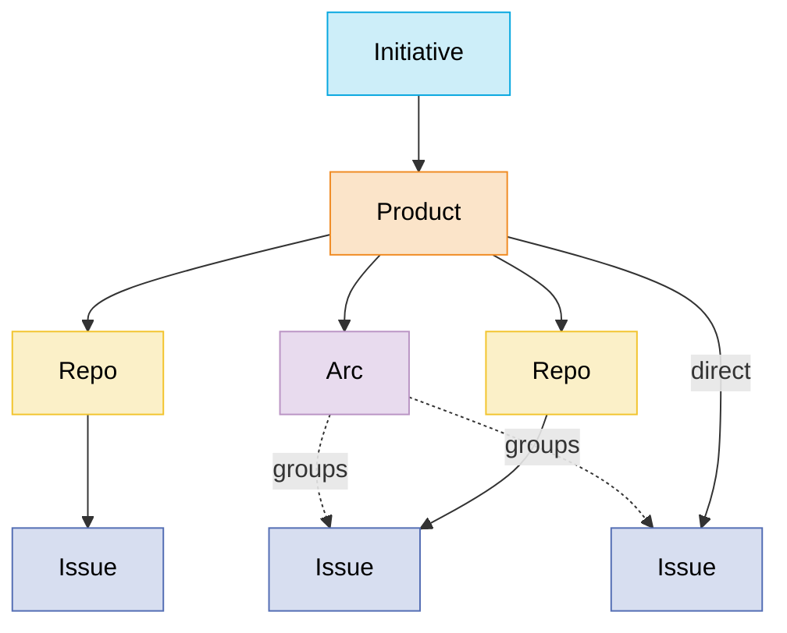

# Progress — Product Spec (v1)

> The source of truth for **what** Progress is and **why**. How-to-work-in-this-repo
> lives in the root `CLAUDE.md`; the rationale behind individual choices lives in
> [`DECISIONS.md`](./DECISIONS.md).

## 1. Vision

**Progress** is a personal product-development tracker — a single-user Linear-class
tool whose hierarchy and vocabulary match how its owner actually thinks about work.

It is **not** a personal to-do app. The domain is building products: initiatives,
products, repos, and the issues that move them forward.

The core insight: existing tools (Linear, Jira, GitHub Issues) fail not on features
but on **nouns**. Their hierarchies don't match the owner's mental model, and the
constant translation is friction. Progress makes the hierarchy itself the product.

### Who it's for

One user (the owner) in v1. The data model anticipates collaborators later
(creator/assignee/author fields exist from day one), but no auth, permissions, or
sharing UI ships in v1.

## 2. Product principles

1. **Speed is a feature, not an optimization.** Every interaction must feel
   instant. This is achieved architecturally (see §8.2), not by tuning later.
   Target: no perceptible lag on any interaction; no spinner ever appears as a
   result of a user mutation.
2. **Rigid simplicity over configurability.** Linear's philosophy, not Jira's.
   One fixed status set, one way to do things. Configuration is a cost, not a
   feature.
3. **Your nouns, exactly.** Initiative → Product → Repo/Arc → Issue. No
   translation layer between the tool's language and the owner's.
4. **Paper-y, open UI.** The look of Linear crossed with the open-page feel of
   Notion. Light, calm, high-contrast, typography-led. Mobile-friendly from v1.

## 3. Domain model

### Entities

| Entity | Parent | Purpose |
|---|---|---|
| **Initiative** | — (top level) | Groups related products into a portfolio-level theme. |
| **Product** | Initiative | The central unit. Owns issues, repos, and arcs. Carries the issue-key prefix (e.g. `PROG`). |
| **Repo** | Product | A sub-container that is also a real git repository (stores its GitHub/git URL). Holds issues whose work lives in that repo. Optional — products may have zero repos. |
| **Arc** | Product | An epic-like grouping of related issues *within one product*. An arc can group issues from anywhere under its product — product-level or any of its repos. (The word "epic" is banned; so is "project".) |
| **Issue** | Product *or* Repo | The atomic unit of work. Belongs to exactly one container (a product directly, or one of its repos), and optionally to one arc. |
| **Tag** | — (global) | Free-form labels, applicable to any issue across all products. |

### Containment & movement rules

- An issue's **container** is either a product or a repo — never both, never neither.
- Issues are **movable**: between product-level and repo-level, between repos, and
  between products. Moving is a first-class, low-friction operation.
- An issue's **arc** must belong to the same product as the issue. Moving an issue
  to a different product clears its arc.
- Moving an issue **within** its product keeps its key. Moving it to a **different
  product** assigns a new key from that product's sequence; the old key remains as
  a permanent alias/redirect so references in commits and notes never break.
- Deleting containers: out of scope to hard-delete anything with issues in it;
  archive instead (v1 ships archive for all container types).

### Issue anatomy

| Field | Values | Notes |
|---|---|---|
| Key | `PREFIX-n` (e.g. `PROG-123`) | Per-product sequence. Stable within a product; see movement rules. |
| Title | text | |
| Description | Markdown | Open, paper-y editing surface. |
| Status | Backlog · Todo · In Progress · In Review · Done · Canceled | Fixed global set. Not configurable. |
| Priority | Urgent · High · Medium · Low · None | Default None. |
| Estimate | 0 · 1 · 2 · 3 · 5 · 8 | Linear-style points. (Scale is an open question — §9.) |
| Tags | 0..n global tags | |
| Arc | 0..1 | Same-product constraint. |
| Comments | Markdown thread | Owner's running notes. |
| Activity | auto-generated | Status changes, moves, linked PRs/commits — interleaved with comments. |
| Created / updated / completed timestamps | auto | |
| Creator / assignee | user reference | Single user in v1; fields exist for multi-user future. |

**Not** on issues in v1: due dates, sub-issues, blocking relations, attachments.

## 4. Views & UX (v1)

### The board — global "My Work" kanban
The landing page. One board across **all** initiatives and products:

- Columns = the fixed statuses (Backlog optionally collapsed).
- Cards show key, title, product, priority, estimate, tags.
- Filterable by initiative, product, repo, arc, tag, priority.
- Drag-and-drop between columns updates status instantly (optimistic).

Per-product / per-initiative / per-arc boards are **deferred** — the global board
with filters covers those cases in v1.

### Container pages
Every initiative, product, repo, and arc has a page: description at top
(Notion-ish open page), issue list below. Lists are sortable/filterable and
support inline status/priority changes.

### Issue page
Full open-page view: title, description, fields in a sidebar/strip, comments +
activity below, linked PRs/commits visible.

### Keyboard & speed UX
- Command palette (`⌘K`): jump to anything, create an issue from anywhere.
- Linear-style single-key actions on a focused issue (e.g. `s` status, `p`
  priority) — exact map decided during build.
- Optimistic everything: the UI never waits for the server on a mutation.

### Mobile
Responsive layout that genuinely works on a phone (board scrolls horizontally,
issue pages reflow). Native apps are out of scope.

## 5. Git integration (v1)

- **Mechanism:** a GitHub webhook (push + pull_request events) per connected repo.
- **Magic words:** mentioning an issue key (`PROG-123`) in a **branch name,
  commit message, or PR title/body** auto-links that commit/PR to the issue.
- **Display:** linked PRs (with open/merged/closed state) and commits appear on
  the issue page and in its activity feed.
- **Explicitly not in v1:** status automation (PR opened → In Review, merged →
  Done) — deferred to v1.x; GitHub Issues sync — non-goal, likely forever.
- The webhook endpoint authenticates via GitHub's HMAC signature and bypasses
  Cloudflare Access (see §8.3).

## 6. v1 scope summary

| In | Out (deferred) | Out (non-goals) |
|---|---|---|
| Full hierarchy: Initiative / Product / Repo / Arc / Issue | Sprints & cycles | GitHub Issues sync |
| Fixed statuses, priority, estimate, global tags | Multi-user accounts & sharing UI | Configurable workflows |
| Global "My Work" kanban with filters | Per-product/initiative/arc boards | Time tracking |
| Container pages + issue page, Markdown everywhere | Notifications / email digests | Native mobile apps |
| Comments + activity feed | Status automation from PRs | |
| Issue movement with key-alias redirects | Due dates, sub-issues, blocking relations | |
| GitHub webhook magic-word PR/commit linking | Saved custom views | |
| Command palette + keyboard actions | API for third-party clients (planned v1.x as the MCP surface, §11) | |
| Mobile-friendly responsive UI | | |

## 7. The dogfood milestone

v1 is "done" when Progress's own backlog moves out of `docs/` and into Progress
itself, running in production, and managing the development of v1.x.

## 8. Architecture

### 8.1 Stack

| Layer | Choice |
|---|---|
| Hosting | Cloudflare Workers (single Worker serves API + static assets) |
| API | Hono (TypeScript, ESM) |
| Database | Cloudflare D1 (SQLite) via Drizzle ORM |
| Frontend | React + Vite + Tailwind CSS |
| Client state | Whole-workspace client store with optimistic mutations (TanStack Query or equivalent — decided at scaffold time) |
| Tooling | Bun (packages & scripts), Node LTS, TypeScript strict, ESM throughout |

### 8.2 The speed architecture (why React will not feel like Jira)

Jira's lag is architectural, not framework-imposed — Linear is React and feels
instant. Progress copies the pattern at a scale where it's easy:

1. **Load everything up front.** A single-user workspace is small (thousands of
   issues ≈ a few MB). On app load, fetch the full workspace into a client-side
   store; render everything from memory thereafter.
2. **Optimistic mutations.** Every user action updates the local store
   synchronously and syncs to the server in the background. Failures roll back
   with a toast (rare in practice).
3. **No interaction spinners.** A spinner after a click is a build failure, not
   a UX choice. Initial app load is the only permitted loading state.
4. **Stay fast by staying small.** Code-split nothing prematurely, but keep the
   dependency budget tight; measure interaction latency as part of review.

### 8.3 Auth & security

- **Cloudflare Access** in front of the entire app — login with the owner's
  identity; the app itself contains no auth code in v1.
- The GitHub webhook route is excluded from Access and instead verifies
  GitHub's `X-Hub-Signature-256` HMAC.
- All secrets via environment (`wrangler secret` in production, `.env` locally,
  never committed). `.env.example` documents required keys.

### 8.4 Data notes

- Schema is multi-user-ready: `users` table (one row in v1), `creator_id` /
  `assignee_id` / `author_id` foreign keys throughout.
- Issue key aliases stored in a dedicated table to power cross-product-move
  redirects.
- Activity events are append-only rows; comments and activity share a timeline.

## 9. Open questions

| # | Question | Current default |
|---|---|---|
| 1 | Estimate scale — points (0/1/2/3/5/8) or t-shirt sizes? | Points |
| 2 | Should Backlog appear on the board by default or live behind a toggle? | Behind a toggle |
| 3 | Tag color/management UX | Minimal: name + auto-color |
| 4 | Client store library (TanStack Query vs. bespoke store) | Decide at scaffold with a latency spike |

## 10. Beyond v1 (direction, not commitment)

Sprint planning on top of the existing model · per-container boards · saved
views · PR-driven status automation · notifications/digests · multi-user ·
**Claude Code agent integration (§11 — the headline v1.x feature)**.

## 11. Claude Code integration (v1.x direction — design now, build after v1)

The owner's development workflow runs through Claude Code. Progress should
close the gap between *tracking* work and *executing* it: an issue carries
enough context (description, comments, arc, product, repo + git URL, linked
PRs) to be an **executable work order**, not just a record.

### 11.1 The context bundle (shared foundation)

A deterministic Markdown rendering of an issue and its surroundings, served
as `GET /api/issues/:key/bundle`:

- Issue: key, title, description, status, priority, estimate, tags.
- Lineage with descriptions: product → repo (incl. `gitUrl`) → arc — the arc
  description is where epic-level intent lives, so the agent sees the *why*.
- Comments (the owner's running notes are usually the freshest context) and
  linked PRs/commits once §5 ships.
- A stable preamble telling an agent how to report back (post a comment,
  update status, mention the key in branch/commit for auto-linking).

One format feeds both directions below; it is also just a useful "copy as
prompt" button for manual use.

### 11.2 Outbound — execute an issue from Progress

A "Work on this" action on an issue (palette command + button) that starts a
Claude Code session primed with the bundle:

- v1.x minimal: copy/handoff — a generated one-liner (e.g.
  `progress work PROG-123`, a small CLI/script that fetches the bundle and
  launches `claude` with it in the right checkout) keeps Progress free of
  machine-specific knowledge about where repos live.
- Later: launch a cloud/headless Claude Code session directly from the web
  UI against the repo's `gitUrl`, working in a branch named from the issue
  key (e.g. `iss/PROG-123`).
- Branch-from-key is the linchpin: it makes §5 magic-word linking automatic,
  so agent work flows back into the issue's activity with zero ceremony.

### 11.3 Inbound — interrogate Progress from Claude Code

Progress exposes an **MCP server** (the Worker already hosts the API; MCP is
the natural "API for third-party clients" from §6, promoted from deferred):

- Tools: get issue/bundle by key, list/filter issues ("my todo in this
  repo"), update status, comment, create issues, move issues.
- The owner says "work on PROG-123" in any Claude Code session; the agent
  pulls the bundle, does the work, posts progress comments, and flips status
  — the same fixed status set keeps agent updates unambiguous.

### 11.4 Prerequisites & sequencing

1. **Production deploy** (§7/§8.3) — agents need a stable URL.
2. **Non-interactive auth**: a Cloudflare Access service token (same pattern
   as the webhook's HMAC bypass) for the bundle/MCP surface; secrets via
   env per §8.3.
3. **§5 webhook linking** — without it the loop doesn't close; with it,
   agent branches/PRs appear on the issue automatically. Build it first.

Roadmap impact: webhook (next) → mobile + deploy + dogfood (v1 done) →
context bundle + MCP server → outbound work-session kickoff.
